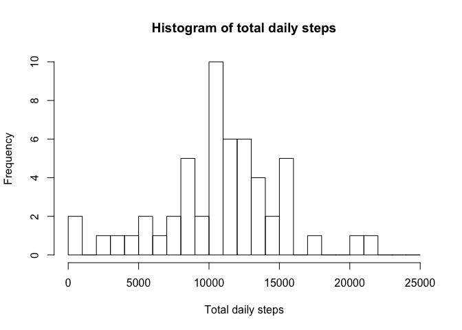
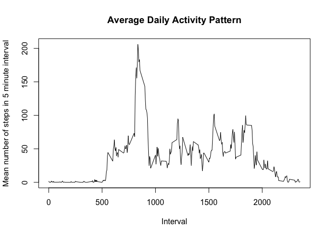
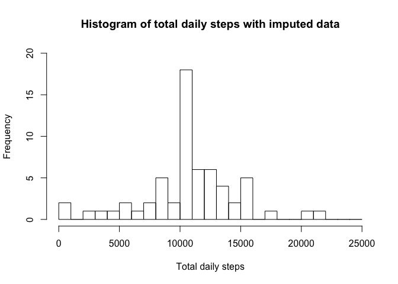
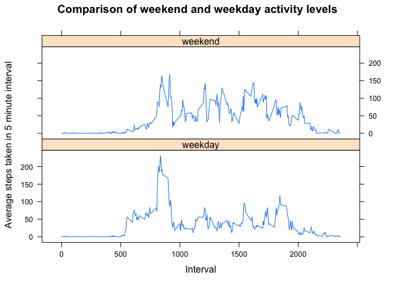

# Reproducible Research: Course Project 1


## Loading and preprocessing the data
First unzip the file and read in the activity.csv file to the dataframe `df'

```r
unzip("activity.zip")
df <- read.csv("activity.csv")
```

The variable names are as follows:

```r
names(df)
```

```
## [1] "steps"    "date"     "interval"
```

Loading the dplyr and data.table libraries

```r
library(dplyr)
```

```
## 
## Attaching package: 'dplyr'
## 
## The following object is masked from 'package:stats':
## 
##     filter
## 
## The following objects are masked from 'package:base':
## 
##     intersect, setdiff, setequal, union
```

```r
library(data.table)
```

```
## 
## Attaching package: 'data.table'
## 
## The following objects are masked from 'package:dplyr':
## 
##     between, last
```

Converting to a data table

```r
dt <- as.data.table(df)
```

## What is mean total number of steps taken per day?
To calculate the mean total number of steps taken per day you must:

 * Sum up all steps taken in each interval in each day to get the total number of steps in each day
 
 * Find the mean value 


```r
grouped_by_date <- dt[, lapply(.SD, sum), by = date]
```

Histogram of the number of steps taken per day:

I changed the bin width here to 1000 steps so I could see more clearly what the overall pattern was. The `breaks=seq(0, 25000, by=1000)' parameter means have bins between 0 and 25000, with bin widths of 1000 steps. 


```r
hist(grouped_by_date$steps, xlab="Total daily steps", ylab='Frequency', main='Histogram of total daily steps', breaks=seq(0, 25000, by=1000))
```

 

Mean and median number of steps taken per day:

```r
mean_steps <- mean(grouped_by_date$steps, na.rm = TRUE)
median_steps <- median(grouped_by_date$steps, na.rm = TRUE)
```

I have removed the days with NA total steps here so that the mean and median can be calculated.

[//]: (To get the mean_steps variable to print correctly I'm using the sprintf command. Takes the same arguments as C printf)

The mean number of steps taken per day is **10766.19**. 

The median number of steps taken per day is **10765**.

## What is the average daily activity pattern?
Now grouping by time interval instead of by date:

```r
grouped_by_interval <- group_by(dt, interval)
```

Finding the mean number of steps in each time interval, removing the NA's from the data so the mean in each interval can be calculated.


```r
mean_steps <- summarise(grouped_by_interval, steps=mean(steps, na.rm=TRUE))
plot(mean_steps$interval, mean_steps$steps, type='l', main='Average Daily Activity Pattern', xlab='Interval', ylab='Mean number of steps in 5 minute interval')
```

 

```r
max_steps_interval <- mean_steps$interval[mean_steps$steps==max(mean_steps$steps)]
```

The interval that contains the maximum number of steps, averaged across all days, is interval number **835**.

## Imputing missing values

*Imputing*: I thought that imputing was a misspelling of *inputing*, but imputing means something different!

**Impution is replacing missing data with substituted values.**

The number of rows with NAs can be calculated pretty quickly. The function is.na returns TRUE if a value is equal to NA, so summing up these results will give the total number of NAs.


```r
nas <- sum(is.na(dt))
```
The total number of NAs in the data is **2304**.

The filling strategy I will use will be to **use the mean value from the 5 minute interval averaged over all days**. I chose this instead of the mean for the day because the missing value may be at a time that is significantly different from the mean value for the day. For example, the mean daily value is very different to the mean midnight value. 


```r
imputed <- merge(dt, data.table(mean_steps), by='interval', all=TRUE)
imputed$steps.x[is.na(imputed$steps.x)] <- imputed$steps.y[is.na(imputed$steps.x)]

setnames(imputed, old=c("interval", "steps.x", "date", "steps.y"), new=c("interval", "steps", "date", "mean_steps")) 
```

In the new data set **imputed** the variable *steps* contains the mean number of steps in that 5 minute interval if the value was previously NA. The variable *mean_steps* is the mean number of steps in that 5 minute interval.


```r
grouped_by_date_imputed <- imputed[, lapply(.SD, sum), by = date]

hist(grouped_by_date_imputed$steps, xlab="Total daily steps", ylab='Frequency', main='Histogram of total daily steps with imputed data', breaks=seq(0, 25000, by=1000), ylim=c(0,20))
```

 

Mean and median number of steps taken per day with imputed data:

```r
mean_steps_imputed <- mean(grouped_by_date_imputed$steps)
median_steps_imputed <- median(grouped_by_date_imputed$steps)
```

Using the imputed data set: 

The mean number of steps taken per day is **10766.19**. 

The median number of steps taken per day is **10766.19**.

The mean value of the number of steps taken per day does not change. The median value of the number of steps per day *does* change. 

Imputing the missing data affects the median as rather than having all the step values be intergers (i.e. there must be an integer number of steps in each five minute interval), they can now be decimal values as I have replaced them with the average value. This means that the median value, which had to be an integer value before, can now also be a decimal value, and has now become equal to the mean.


## Are there differences in activity patterns between weekdays and weekends?

For this part the 𝚠𝚎𝚎𝚔𝚍𝚊𝚢𝚜() function may be of some help here. Use the dataset with the filled-in missing values for this part.

Now I am looking to see if there are any differences in activity levels between the weekdays and weekends.

The 'chron' library has a function that can tell you if something is a weekday or a weekend:


```r
library(chron)
wd_factor <- as.factor((is.weekend(as.Date(imputed$date))))
levels(wd_factor) <- c('weekday', 'weekend')
imputed_factor <- cbind(imputed, wd_factor)
```

And finally make a panel plot to compare the activity levels on weekdays and weekend days. I need the 'lattice' library for this.


```r
library(lattice)
factorised_intervals <- imputed_factor[, lapply(.SD, mean), by = c('interval', 'wd_factor')]

xyplot(steps ~ interval | wd_factor, data =factorised_intervals, type='l', layout=c(1,2), main='Comparison of weekend and weekday activity levels', xlab='Interval', ylab='Average steps taken in 5 minute interval')
```

 


